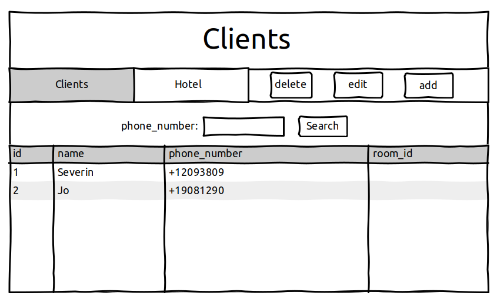
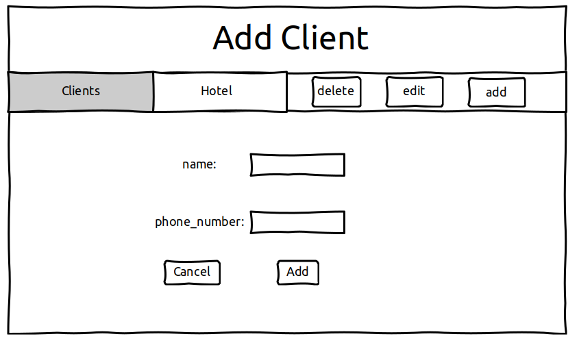
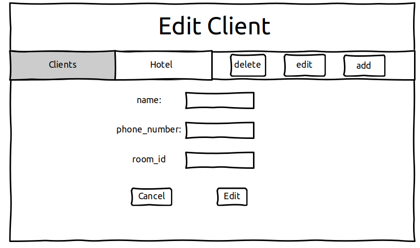
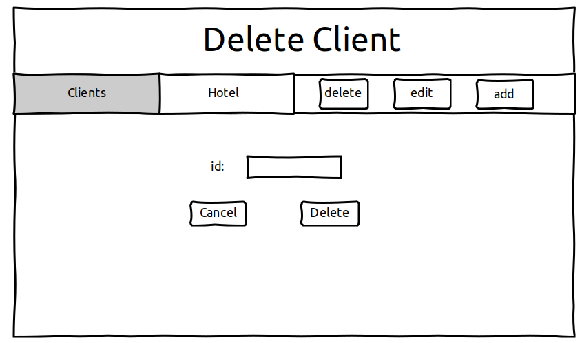
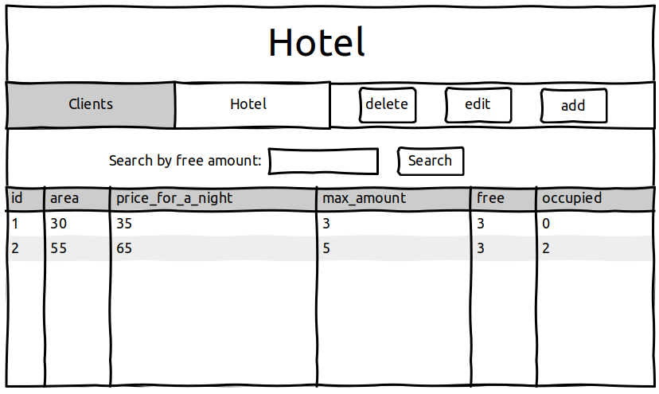
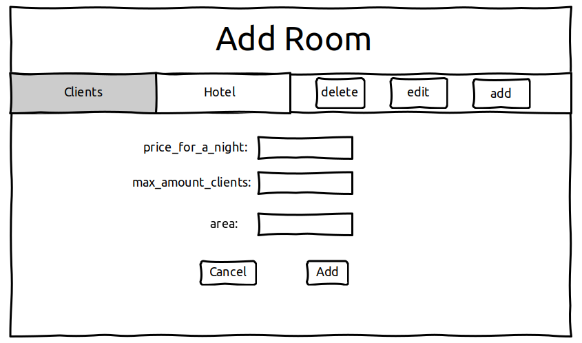
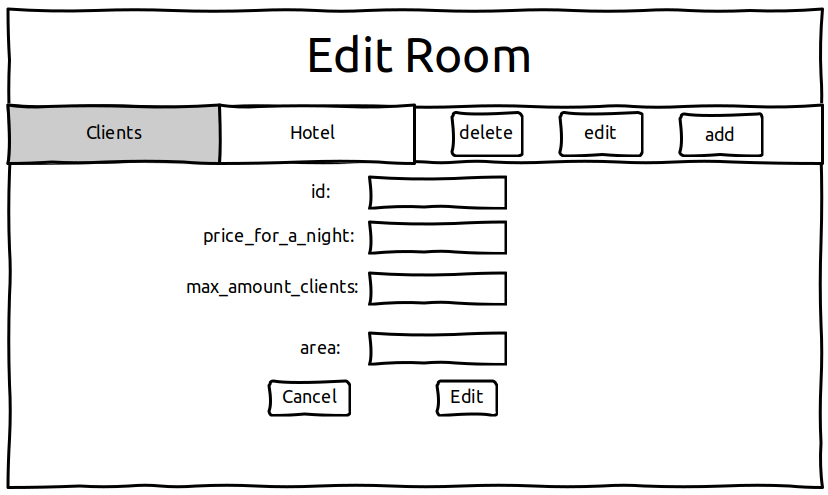
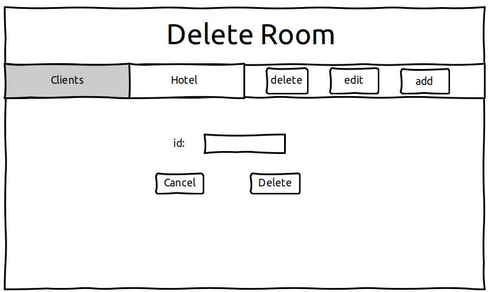

# Hotel Rent Room
It is web-application which allows users to record information about clients, rooms in hotel and the rental
orders.

## 1.Clients
### 1.1 Display list of Clients
This mode is intended for viewing and editing the clients list. 
Main scenario:
* User selects item “Clients”
* Application displays list of clients

The list displays the following columns:
* id - unique client id
* name - client name
* phone_number - client phone number
* room_id - rented room

### 1.2 Add a Client
Main scenario:
* User clicks the “Add” button in the clients list view mode
* Application displays form to enter client data
* User enters client data and presses “add” button
* If any data is entered incorrectly, incorrect data messages are displayed;
* If entered data is valid, then record is adding to database
* If error occurs, then error message is displaying
* If new client is successfully added, then list of clients with added records is displaying

Cancel operation scenario:
* User clicks the “Add” button in the order list view mode
* Application displays form to enter client data
* User enters client data and presses “Cancel” button;
* Data don’t save in database, then list of clients is displaying to user.
* If the user selects the menu item ”Clients” or "Hotel", the data will not be applied.

### 1.3 Edit Client
Main scenario:
* User clicks the “Edit” button in the client list view mode
* Application displays form to enter client data
* User enters client data and presses “Save” button
* If any data is entered incorrectly, incorrect data messages are displayed
* If entered data is valid, then edited data is added to database
* If error occurs, then error message is displaying
* If order record is successfully edited, then list of clients with added records is displaying

Cancel operation scenario:
* User clicks the “Edit” button in the orders list view mode;
* Application displays form to enter new client data
* User enters new client data and presses “Cancel” button;
* Data don’t save in database, then list of clients is displaying to user.
* If the user selects the menu item ”Clients” or "Hotel", the data will not be applied.

### 1.4 Client delete
Main scenario:
* User clicks the “delete” button in the client list view mode
* Application displays form to enter client id
* User enters client id and presses “delete” button
* If any data is entered incorrectly, incorrect data messages are displayed
* If error occurs, then error message is displaying

## 2. Hotel
### 2.1 Display list of room
This mode is intended for viewing and editing the rooms list. 
Main scenario:
* User selects item “Hotel”
* Application displays list of rooms

The list displays the following columns:
* id - unique room id
* area - area of a room
* price_for_a_night - price for one night
* max_amount - max numbers of clients in room
* free - numbers of free place on room
* occupied - numbers of occupied place on room

### 2.2 Add a room
Main scenario:
* User clicks the “Add” button in the room list view mode
* Application displays form to enter room data
* User enters room data and presses “add” button
* If any data is entered incorrectly, incorrect data messages are displayed;
* If entered data is valid, then record is adding to database
* If error occurs, then error message is displaying
* If new room  is successfully added, then list of orders with added room is displaying

Cancel operation scenario:
* User clicks the “Add” button in the order list view mode
* Application displays form to enter room data
* User enters order data and presses “Cancel” button;
* Data don’t save in database, then list of orders records is displaying to user.
* If the user selects the menu item ”Clients” or "Hotel", the data will not be applied.

### 2.3 Edit Room
Main scenario:
* User clicks the “Edit” button in the room list view mode
* Application displays form to enter room data
* User enters room data and presses “Edit” button
* If any data is entered incorrectly, incorrect data messages are displayed
* If entered data is valid, then edited data is added to database
* If error occurs, then error message is displaying
* If room is successfully edited, then list of rooms with added records is displaying

Cancel operation scenario:
* User clicks the “Edit” button in the room list view mode;
* Application displays form to enter room data;
* User enters order data and presses “Cancel” button
* Data don’t save in database, then list of orders records is displaying to user.
* If the user selects the menu item "Orders”, ”Clients” or "Hotel", the data will not be applied.

### 2.4 Room delete
Main scenario:
* User clicks the “delete” button in the room list view mode
* Application displays form to enter room id
* User enters room id and presses “delete” button
* If any data is entered incorrectly, incorrect data messages are displayed
* If error occurs, then error message is displaying

Cancel operation scenario:
* User clicks the “Delete” button in the room list view mode;
* Application displays form to enter room data;
* User enters order data and presses “Cancel” button
* Data don’t save in database, then list of orders records is displaying to user.
* If the user selects the menu item "Orders”, ”Clients” or "Hotel", the data will not be applied.